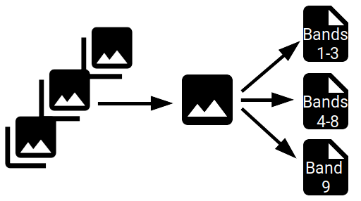

An _image collection_ is simply a set of images where all images contain identical variables (_bands_). 
Images have a spatial footprint and a recording date/time. Values of the bands from one image may be stored in a single 
or in several files and bands may also differ in their spatial resolution. Two different images in a collection may have 
different map projections.  
  
The figure below illustrates the basic structure: the image collection has 3 images, images each have a spatial extent, recording date/time, and a map projection and in this case 9 bands, where the band data come from three files per image.

For example, Landsat imagery comes in a very simple format where one image consist of a set of GeoTIFF files with a one to one relationship between files and bands.
MODIS data in contrast come as one HDF4 file per image that contains all bands.

In gdalcubes, anything that is readable by GDAL may contain actual band data of an image. Typically, this will be files, 
but actually can be anything that [the `gdalinfo` command](https://www.gdal.org/gdalinfo.html) understands, including
cloud storage, databases, and archive files (see below) through [GDAL virtual file systems](https://www.gdal.org/gdal_virtual_file_systems.html). 
Examples for valid GDAL dataset references include `/vsizip/archive.zip/xyz.tif` (a GeoTIFF file in a .zip archive), 
`test.tif` (a simple local GeoTIFF file), `SENTINEL2_L1C:S2A_OPER_MTD_SAFL1C_PDMC_20150818T101440_R022_V20150813T102406_20150813T102406.xml:10m:EPSG_32632` (higher level GDAL Sentinel 2 datasets),
`/vsicurl/https://download.osgeo.org/geotiff/samples/spot/chicago/UTM2GTIF.TIF` (file on an HTTP server). 
Instead of _files_ we therefore often use the terms _GDAL dataset reference_ or _GDAL dataset descriptor_.

Images, bands, and GDAL dataset references are indexed by gdalcubes in a single image collection file. This file is a 
simple [SQLite](https://www.sqlite.org/index.html) database, which stores links to all GDAL dataset references and how they
relate to images and bands. To allow fast filtering, the collection file additionally stores the spatial extent, the 
aquisition date/time, and the spatial reference system of images. Further imagary metadata is currently not included but
future releases will do so, e.g. to filter images in a collection by cloud cover.

